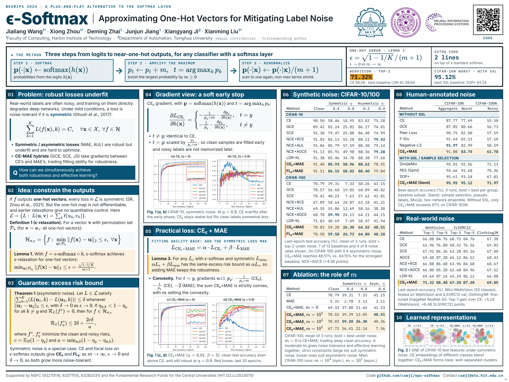

<div align="center">

# ε-Softmax

### Approximating One-Hot Vectors for Mitigating Label Noise

**Official PyTorch Implementation · NeurIPS 2024**

[](https://arxiv.org/abs/2508.02387)
[](https://opensource.org/licenses/MIT)

[Overview](#overview) · [Poster](#poster) · [Usage](#usage) · [Examples](#examples) · [Citation](#citation) · [Contact](#contact)

</div>

---

<a id="overview"></a>

## ✨ Overview

**$\epsilon$-Softmax** approximates one-hot vectors to mitigate label noise. This repository provides the official implementation and training scripts for benchmark datasets, semi-supervised learning, and real-world noisy datasets.

- **Loss functions:** $\epsilon$-softmax with cross-entropy (CE) or focal loss (FL), combined with mean absolute error (MAE).
- **Noise settings:** Symmetric, asymmetric, instance-dependent, and human label noise.
- **Datasets:** CIFAR-10, CIFAR-100, CIFAR-N, WebVision, and Clothing1M.

> [!NOTE]
> In the code, **ECE** and **EFL** denote CE and FL with $\epsilon$-softmax, respectively. Their combinations with MAE are named `ECEandMAE` and `EFLandMAE`.

<a id="poster"></a>

## 🖼️ Poster

<div align="center">

<a href="assets/poster.png">
  
</a>

<!-- [View full-resolution poster](assets/poster.png) -->

</div>

<a id="usage"></a>

## 🛠️ Usage

### Get the code

```bash
git clone https://github.com/cswjl/eps-softmax.git
cd eps-softmax
```

### Choose a training script

| Setting | Entry point | Datasets | Noise types |
| :--- | :--- | :--- | :--- |
| Benchmark | [`main.py`](main.py) | `cifar10`, `cifar100` | `symmetric`, `asymmetric`, `dependent`, `human` |
| Semi-supervised | [`main_semi.py`](main_semi.py) | `cifar10`, `cifar100` | `symmetric`, `asymmetric`, `dependent`, `human` |
| Real-world | [`main_real_world.py`](main_real_world.py) | `webvision`, `clothing1m` | Real-world label noise |

### Configure an experiment

| Argument | Description | Example values |
| :--- | :--- | :--- |
| `--dataset` | Dataset to train on | `cifar10`, `cifar100`, `webvision`, `clothing1m` |
| `--loss` | Loss function for benchmark and real-world training | `ECEandMAE`, `EFLandMAE`, `CE`, `GCE` |
| `--noise_type` | Label noise type for benchmark and semi-supervised training | `symmetric`, `asymmetric`, `dependent`, `human` (see supported settings above) |
| `--noise_rate` | Synthetic noise rate or human annotation variant | `0.8`, `worst`, `noisy100` |
| `--root` | Dataset root directory | `../data` (default) |

For CIFAR-N experiments, use `--noise_type human` with a matching annotation variant: `worst` for CIFAR-10 or `noisy100` for CIFAR-100, for example.

> [!TIP]
> Set `--root` to your local data directory. For WebVision, also update the image paths in the dataset lists under [`datasets/`](datasets/), as indicated in [`main_real_world.py`](main_real_world.py). Training scripts use CUDA; prepare a compatible PyTorch environment before running experiments.

<details>
<summary><strong>📂 Repository structure</strong></summary>

```text
eps-softmax/
├── main.py                 # Benchmark training
├── main_semi.py            # Semi-supervised training
├── main_real_world.py      # Real-world dataset training
├── losses.py               # Loss function implementations
├── config.py               # Loss and regularization configurations
├── models.py               # Network architectures
├── utils.py                # Training and evaluation utilities
└── datasets/               # Data loaders, noise annotations, and dataset lists
```

</details>

<a id="examples"></a>

## 🚀 Examples

### CIFAR-10 · 80% symmetric noise

Train with **ECE + MAE** on CIFAR-10:

```bash
python3 main.py --dataset cifar10 --noise_type symmetric --noise_rate 0.8 --loss ECEandMAE
```

### CIFAR-N · Human label noise

Train with **ECE + MAE (Semi)** using the CIFAR-10 `worst` human annotation variant:

```bash
python3 main_semi.py --dataset cifar10 --noise_type human --noise_rate worst
```

<!-- ### CIFAR · Instance-dependent label noise

Train with **ECE + MAE (Semi)** using the same dependent-noise data loader as the benchmark script:

```bash
python3 main_semi.py --dataset cifar10 --noise_type dependent --noise_rate 0.4
python3 main_semi.py --dataset cifar100 --noise_type dependent --noise_rate 0.6
```

Precomputed noisy labels for rates `0.2`, `0.4`, and `0.6` are included in [`datasets/data_dependent/config/`](datasets/data_dependent/config/). At `0.6`, the per-class sample selection count `k` starts at `1500` for CIFAR-10 and `150` for CIFAR-100; these are heuristic defaults to tune for your experiments. -->

### WebVision · Real-world label noise

Train with **ECE + MAE** on WebVision:

```bash
python3 main_real_world.py --dataset webvision --loss ECEandMAE
```

<a id="citation"></a>

## 🎓 Citation

For method details and experimental results, see our [paper](https://openreview.net/pdf?id=vjsd8Bcipv). If you find this work useful in your research, please consider citing:

```bibtex
@inproceedings{wang2024epsilonsoftmax,
  title={$\epsilon$-Softmax: Approximating One-Hot Vectors for Mitigating Label Noise},
  author={Jialiang, Wang and Xiong, Zhou and Deming, Zhai and Junjun, Jiang and Xiangyang, Ji and Xianming, Liu},
  booktitle={The Thirty-eighth Annual Conference on Neural Information Processing Systems},
  year={2024}
}
```

<a id="contact"></a>

## 📬 Contact

For questions about the paper or code, please contact **Jialiang Wang** at [cswjl@stu.hit.edu.cn](mailto:cswjl@stu.hit.edu.cn).

---

<div align="center">


**⭐ Star us on GitHub - it motivates us a lot!**

</div>
